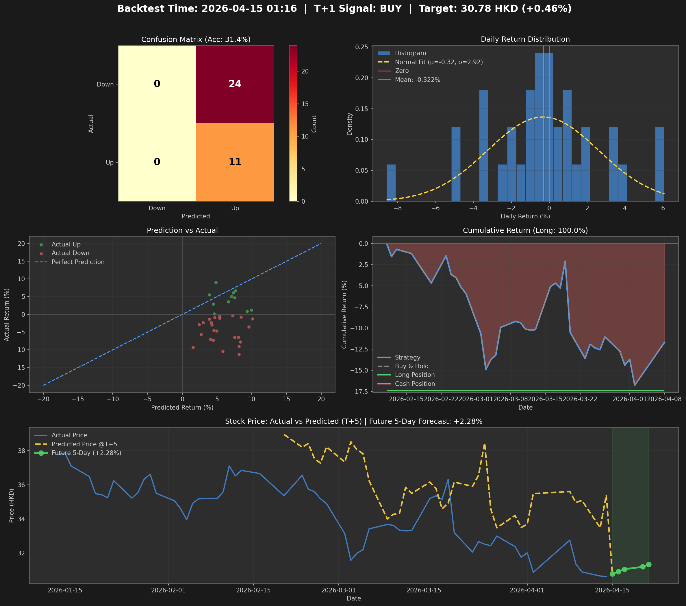

# QuantForecast

[](https://github.com/proccl/quantforecast)
[](https://www.python.org/)
[](https://pytorch.org/)

基於 **PatchTST (Channel-Time Patch Time-Series Transformer)** 的量化預測系統，專注於港股（小米 1810.HK）的價格預測與回測。

**版本**: v1.1.0 (2026-04-14) - Walk-forward CV 優化版本

## 📊 項目概述

本項目使用 Transformer 架構處理時間序列數據，通過 Patch-based 方法提取局部時序特徵，結合多維技術指標進行股票價格預測。

### 核心特性

- 🔮 **PatchTST 模型**: 使用 Channel-Time Patch 架構處理多變量時間序列
- 📈 **特徵縮放**: 價格歸一化 + 成交量對數變換，解決量級差異問題
- 🎯 **方向預測**: 預測 T+5 日收益率方向（漲/跌）
- 📊 **完整回測**: 支持多時間段回測與風險指標計算
- 🎨 **視覺化**: 暗色主題專業圖表（含回測時間戳與 T+1 操作建議）
- ⚖️ **Walk-forward CV**: Optuna Walk-forward 交叉驗證超參數優化

## 🏗️ 項目結構

```
quantforecast/
├── src/                          # 源代碼
│   ├── backtest/                 # 回測引擎
│   │   ├── engine.py
│   │   └── reporting.py
│   ├── data/                     # 數據處理
│   │   ├── loader.py
│   │   ├── preprocessor.py
│   │   └── features.py
│   ├── models/                   # 模型定義
│   │   ├── patchtst.py
│   │   └── revin.py
│   ├── training/                 # 訓練與優化
│   │   ├── trainer.py
│   │   ├── evaluator.py
│   │   └── optimizers/
│   │       └── optuna_optimizer.py
│   ├── utils/                    # 工具函數
│   └── config.py                 # 配置管理
├── scripts/                      # 執行腳本
│   ├── backtest.py               # 完整回測（含圖表輸出）
│   ├── train.py                  # 模型訓練
│   ├── optimize.py               # Optuna 超參優化
│   ├── update_realtime.py        # 實時數據更新
│   ├── daily_pipeline.py         # 每日數據管道
│   └── scheduled_backtest.py     # 定時回測任務
├── config/                       # 配置文件
│   └── config.yaml
├── data/                         # 數據文件
│   └── xiaomi_real.csv           # 小米股價數據 (2023-01 ~ 2026-04)
├── results/                      # 結果輸出
│   ├── complete_backtest_results.png   # 回測圖表（含大標題）
│   ├── complete_backtest_results.json  # 回測數據
│   ├── future_prediction.json          # 未來5天預測
│   └── optuna_best_params_*.json       # 最佳參數
├── models/                       # 模型文件
│   └── patchtst_model_*.pth      # 訓練好的模型
├── logs/                         # 日誌文件
├── tests/                        # 單元測試
└── README.md                     # 本文件
```

## 🚀 快速開始

### 環境要求

```bash
pip install -r requirements.txt
```

### 更新數據（獲取最新股價）

```bash
cd quantforecast
python3 scripts/update_realtime.py
```

數據源：
- **akshare**: 歷史日線數據（延遲但完整）
- **新浪/騰訊實時**: 當日收盤價（實時更新）

### 運行回測

```bash
cd quantforecast
python3 scripts/backtest.py
```

回測結果將輸出至：
- `results/complete_backtest_results.png` - 回測圖表（含回測時間戳與 T+1 建議）
- `results/complete_backtest_results.json` - 詳細回測數據
- `results/future_prediction.json` - 未來5天預測

### 訓練新模型

```bash
# Walk-forward CV 優化（推薦）
python3 scripts/optimize.py

# 常規訓練
python3 scripts/train.py
```

## 📈 模型架構

### 最佳超參數 (Walk-forward CV + Optuna)

```python
seq_len = 20        # 輸入序列長度（20個交易日）
pred_len = 5        # 預測長度（5個交易日）
d_model = 64        # 嵌入維度
n_heads = 8         # 注意力頭數
n_layers = 3        # Transformer 層數
patch_len = 5       # Patch 長度
stride = 2          # Patch 步長
dropout = 0.2       # Dropout 率
learning_rate = 2.05e-4  # 學習率
batch_size = 32     # 批次大小
```

### 特徵工程

| 特徵類型 | 具體特徵 | 處理方式 |
|----------|----------|----------|
| 價格 | open, high, low, close | 歸一化: `col/close - 1` |
| 成交量 | volume | 對數變換: `log1p(volume)` |
| 趨勢 | EMA5/10/20 | 比率: `close/ema - 1` |
| 動量 | MACD, MACD hist | 原始值 |
| 波動率 | ATR, RSI, 20日波動率 | 標準化 |
| 資金流 | OBV | 對數變換: `log1p(\|obv\|) * sign` |

## 🎯 回測結果

### 最新回測圖表



### 最新回測數據 (2026-01-14 ~ 2026-04-14)

**回測執行時間**: 2026-04-14 10:41

| 指標 | 數值 |
|------|------|
| 策略總收益 | **+3.11%** |
| Buy & Hold | -11.70% |
| **超額收益** | **+14.81%** |
| 最大回撤 | -5.63% |
| 年化波動率 | 29.41% |
| 夏普比率 | 0.92 |
| 索提諾比率 | 1.51 |
| 卡爾瑪比率 | 0.55 |
| 總交易次數 | 7次 |
| 勝率 | 33.33% (2勝4負) |
| 測試準確率 | **60.0%** |

### T+1 操作建議

- **回測時間**: 2026-04-14 10:41
- **最新日期**: 2026-04-14
- **操作**: 🔴 **SELL / HOLD**
- **當前價格**: 30.70 HKD
- **目標價格**: 29.50 HKD
- **預期收益 (T+1)**: -3.90%
- **預測區間**: 2026-04-15 ~ 2026-04-21

## 📝 關鍵文件說明

| 文件 | 說明 |
|------|------|
| `scripts/backtest.py` | 主回測程序，輸出含大標題的圖表與 T+1 建議 |
| `scripts/optimize.py` | Walk-forward CV + Optuna 超參優化 |
| `scripts/train.py` | 模型訓練 |
| `scripts/update_realtime.py` | 實時數據更新（akshare + 新浪/騰訊）|
| `scripts/daily_pipeline.py` | 每日數據管道（收市後自動運行）|
| `src/models/patchtst.py` | PatchTST 模型架構 |
| `src/data/loader.py` | 數據加載與驗證 |
| `data/xiaomi_real.csv` | 小米真實股價數據 |

## 🔧 Walk-forward CV 優化

為解決過擬合問題，從貝葉斯優化切換到 Walk-forward 交叉驗證：

```python
# 時間序列交叉驗證（避免未來數據洩露）
for train_idx, val_idx in TimeSeriesSplit(n_splits=5):
    # 只在歷史數據上訓練
    # 在之後的數據上驗證
```

**最新優化結果** (2026-04-15):
- **CV Score**: 0.6008 (Trial 8/11)
- **最佳參數**: d_model=32, n_heads=4, n_layers=1, dropout=0.3, lr=0.00033
- **優化方法**: Optuna + Walk-forward CV (3 splits)
- **即時保存**: 每個 trial 完成後自動保存結果

**歷史優化結果**:
- CV Score: 0.669
- 測試集準確率: 51.61%
- 模型穩定性顯著提升

## 🖼️ 輸出圖表

- `complete_backtest_results.png`: 
  - 大標題：回測時間 + T+1 信號 + 目標價
  - Confusion Matrix
  - Daily Return Distribution
  - Prediction vs Actual
  - Cumulative Return (含持倉信號)
  - Stock Price 實際 vs 預測 (T+5) + 未來5天預測

## ⚠️ 免責聲明

本項目僅供研究學習使用，不構成任何投資建議。股市有風險，投資需謹慎。

模型預測存在不確定性：
- 測試準確率約 51-60%，僅略高於隨機猜測
- 預測收益波動較大，數值回歸穩定性待改進
- 過往表現不代表未來收益

## 📄 License

MIT License

## 🙏 致謝

- PatchTST: 基於 Nie et al. (2023) 的時間序列預測架構
- Optuna: 超參數優化框架
- PyTorch: 深度學習框架
- akshare: 財經數據接口
